# Robot Motion Planning - DSND Capstone project

I. Definition
=============

Executive Summary
-----------------

This project is about developing a virtual robot that will navigate a virtual
maze utilizing different methods. It is inspired by the micromouse competition
popularized by IEEE – for a very interesting article please see this link [The
Amazing MicroMouse
Contest](http://spectrum.ieee.org/consumer-electronics/gadgets/the-amazing-micromouse-contest).
In this project except for the maze dimensions nothing else is known. So the
robot has to _first explore and then exploit_ the maze.

The objective is for the robot to reach the goal – a set of rooms in the center
of the maze, using the best possible algorithm in the best possible time. Three
maze definition files are given. The solution needs to apply different methods
of navigation to reach the center of these arrays. A _tester_ program is provided
to apply the solution to solve a given maze and a score is given. 

I have developed the solution using several popular algorithms – *Follow the
Wall*, *Breadth First Search*, *Depth First Search*, *Uniform Cost Search, A\*
(aka A Star) search* and the *Flood Fill search*. 

The approach, the methodology and the results are documented here. The
conclusion is that the Flood Fill method is the best algorithm to solve the
navigation of a maze effectively.

The project definition is available in Udacity at this link [Plot and Navigate a Virtual Maze](https://docs.google.com/document/d/1ZFCH6jS3A5At7_v5IUM5OpAXJYiutFuSIjTzV_E-vdE/pub). The starter code
is given at this link (AI_starter_code.zip)[https://drive.google.com/file/d/0B9Yf01UaIbUgQ2tjRHhKZGlHSzQ/view].
__(Caution: this code is in Python 2.7. As this project requires Python 3.0+, I have updated the code and posted it 
in this repository to be used for testing etc.)__

Domain background
-----------------

The project relates to the domain of **_robot localization and movement planning_**.
For effective motion, a robot needs to know its position in the real or virtual world space,
decide on the action to take and then complete the action – while
considering the goal at all times.

The core idea of this project is based on the popular maze solving competition
for robots – the Micromouse [(wikipedia
description)](https://en.wikipedia.org/wiki/Micromouse) competition. I have also
come across the Trinity College Firefighting Robot competition where a robot
must find a room in a home (a maze) with an open fire and extinguish it in the
shortest possible time. Trinity College competition references: ( [Tufts
University
description](https://wikis.uit.tufts.edu/confluence/display/TuftsRobotics/Trinity+College+Firefighting+Robot+Competition)
) ([Rules of the competition](http://robogames.net/rules/fire-fighting.php)).

In both competitions, the robot has to locate a goal (either the center of the
maze or a lit candle) in the shortest possible time and consistently over
multiple trials. The robot depends on sensor readings – the sensors can be
touch, IR, SONAR, LIDAR and/or on-board cameras.

Problem Statement
-----------------

We are given defined mazes of n x n dimensions where n = 12, 14 and 16. The
virtual robot must traverse these mazes (one at a time) from the lower left
corner (home) to the center (the goal). The robot must find the optimal path to
the center in the least number of movements. It will be given one opportunity to
locate the goal and explore the maze and another opportunity to execute on the
best route to goal found in the first run.

Metrics
-------

The *tester.py* program, included as part of the starter code, uses the *Robot*
class (in *robot.py*) to navigate the maze using the search algorithms. The test
condition is that the robot is given a maximum of 1000 time steps to locate the
goal otherwise the run is said to have failed. It also reports back a score
based on the formula (from the project definition) given below:

**Run Score = (Time steps for Second run) + 1/30(Time steps for First run)**

The algorithms will be tested with the given mazes with multiple runs/trials.
Please see the *Results* section for the collected results and analysis.

As the score is automatically calculated by the *tester.py,* we need to use it
to compare the trial runs for each maze for each method. There could have been
other measurements such as time taken to traverse the maze etc., but in this
particular case we need to note that the project uses the concept of a “time
step”. Every move that the robot makes by sending the command to move and turn
(Rotation, Movement) results in one time step. This isolates and standardizes
the time factor by making it uniform regardless of the environment. So whether
this project is run on a super computer or a student’s laptop, the results will
be comparable & allow easy analysis.

The Benchmark section details how this metric will be utilized to calculate the
normalized score i.e., the Normal score calculated by comparing the current
trial score to the best trial score for a given maze.

II. Analysis
============

Data Exploration and visualization
----------------------------------

### Datasets and Inputs

The virtual robot is given information about the maze in the form of a text file
(*Figure 1)*. The first line of the file gives the dimension of the maze (n) and
the rest of the (n) lines define the maze. Here n is 12 for test_maze_01.
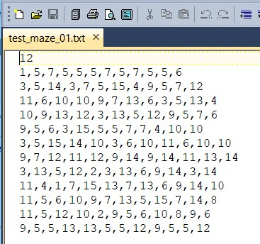
*Figure 1* - test_maze_01.txt file

Each line in the text file has (n) integer numbers whose 4 bit (binary)
representation gives the robot of the shape of the maze cell it is in. The
representation is shown below – with “1” indicating an opening and “0”
indicating a wall:

|    | **2\^3** | **2\^2**   | **2\^1**  | **2\^0** | **Description**            |
|----|----------|------------|-----------|----------|----------------------------|
|    | **Left** | **Bottom** | **Right** | **Up**   | **(open – or no wall)**    |
| 1  | 0        | 0          | 0         | 1        | Only Up (top)              |
| 2  | 0        | 0          | 1         | 0        | Right only                 |
| 3  | 0        | 0          | 1         | 1        | Right & Up                 |
| 4  | 0        | 1          | 0         | 0        | Only Bottom (down)         |
| 5  | 0        | 1          | 0         | 1        | Bottom & Up                |
| 6  | 0        | 1          | 1         | 0        | Bottom & Right             |
| 7  | 0        | 1          | 1         | 1        | Bottom, Right and Up       |
| 8  | 1        | 0          | 0         | 0        | Left only                  |
| 9  | 1        | 0          | 0         | 1        | Left & Up                  |
| 10 | 1        | 0          | 1         | 0        | Left & Right               |
| 11 | 1        | 0          | 1         | 1        | Left, Right and Up         |
| 12 | 1        | 1          | 0         | 0        | Left & Bottom              |
| 13 | 1        | 1          | 0         | 1        | Left, Bottom and Up        |
| 14 | 1        | 1          | 1         | 0        | Left, Bottom and Right     |
| 15 | 1        | 1          | 1         | 1        | All walls open = no walls! |

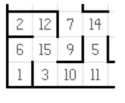
*Figure 2* illustrates the maze and cell structure (from the project document)

-   Please note that the walls are in reference to the virtual robot facing
    “top” of the maze.

-   There is no data preprocessing in this project.

    The maze corresponding to *test_maze_01.txt* file is shown below *Figure 3* – generated
    using the *showmaze.py* file provided with the project. The
    *Appendix* shows the other 2 mazes.

    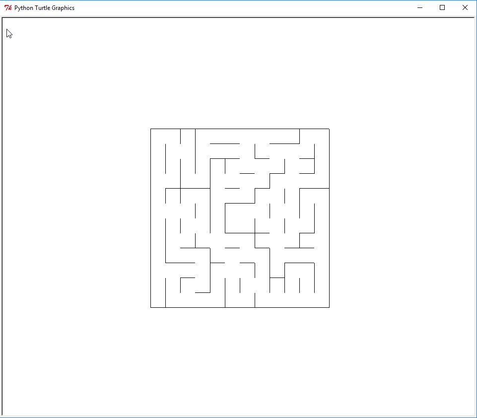
*Figure 3* Visualization of test_maze_01 as shown by showmaze.py

### Robot sensor input

The robot has 3 sensors – **Left, Forward** and **Right**. These sensors report
how many cells are open to the left, front and right of the robot. For example,
in the test_maze_01.txt maze (Figure 3) the first cell has walls on the Left and
Right and is open at the front for 11 cells. The sensor reading for this is 0,11,0.

At every step the robot will receive information, from the _tester.py_ program, on
the number of open cells as seen by the 3 sensors. The data corresponds to the
Left, Center and Right sensors. The robot has to decide and act based on these
inputs whether to move or not. If a move is possible it will also have to decide
on which direction to move as there may be more than 1 direction that has open
cells.

Algorithms and Techniques
-------------------------

I researched several possible approaches to this problem. There are many ways of guiding
the robot starting with simple methods such as Wall Following and brute force
method of exploring every cell, all the way to complex methods such as SLAM
(Simultaneous Localization and Mapping - [Wikipedia entry on
SLAM](https://en.wikipedia.org/wiki/Simultaneous_localization_and_mapping)) and
Flood Fill (details below).

The problem is well known due to the micromouse competition (and variants like
the Trinity College competition) and there are many methods that are described
in detail on the web.

I focused on learning the following methods and seeing how they can be applied
to this project:

-   Simple methods (this article documents pretty much all of the methods
    nicely:[mazes and solving
    them](http://www.astrolog.org/labyrnth/algrithm.htm))

    -   *Wall following*: the robot moves and when it hits a wall it turns right
        (or left) and continues. This works for simple mazes but the given mazes are not simple enough
        for this method to be used. This method is also called “dead reckoning”.

    -   *Block deadend* (or deadend learning): this method is similar to wall
        following with the improvement that any cells found to be deadends are
        blocked off so that they are not included in the next routing. There is
        a chance for the robot to go around in loops for some maze designs.

    -   *Breadth/Depth First search*: these methods “traverse” a tree
        representation of the maze. The Breadth First algorithm traverses a tree 
        and searches all the cells “across” a level and then moves to the next level. 
        The Depth First method traverses one branch of the tree till it reaches the end.
        Then it starts with the next branch. Both methods work consistently but
        may not result in the optimal solution.

-   *A\* or A Star search*: This method, given a start and end position searches
    all paths and finds the path with the least time or steps etc. (also
    referred to as costs) ([A\* Search - wikipedia
    entry](https://en.wikipedia.org/wiki/A*_search_algorithm)). This is one of
    the better algorithms to use.

    -   While researching this I came across the amazing PACMAN project of UC
        Berkley that utilized graph search techniques in their course Intro to
        AI ([UC Berkley CS 188 - Intro to
        AI](http://ai.berkeley.edu/project_overview.html)). This taught me a lot
        about the various search methods and also helped me study code to
        understand how to implement the methods. The file *util.py* is used in
        this project for the search agent implementation.

-   *Flood Fill search:* This has been the algorithm of choice for maze solving.
    If one imagines a maze to be a series of levels that drop down
    towards the center, flood fill would be the way water would flow towards the
    center “goal”. It will find the path of least resistance quickly ([Flood
    fill approach to the IEEE micro-mouse
    competition](http://www.alexhadik.com/micromau5/)). The implementation is
    complex but there are plenty of code examples available. One point to note
    is that this would find the shortest but may be not the fastest in terms of
    time solution. Our scenario is setup such that a time step is one movement
    and we need to achieve the goal in the least number of time steps – so this
    may be a good algorithm to try. A good description of this recursive
    technique can be found here - [Recursion explained with flood
    fill](http://inventwithpython.com/blog/2011/08/11/recursion-explained-with-the-flood-fill-algorithm-and-zombies-and-cats/).

The final solution should locate the optimal path with the least number of steps
and be able to repeat the result consistently. The results will be measured in
the number of steps it takes for the robot to find the center of the maze.

Benchmark
---------

The scoring method is defined in the project specifications as below:

*Score = Number of steps to complete Run 2 + (Number of steps to complete Run
1)/30*

-   1000 steps are allowed to complete the runs – anything over this would be
    considered a failed run.

-   The score is calculated and reported by the *tester.py* program provided.

Scores will vary for each method and for each type of maze.

The purpose of the benchmark is to evaluate the different algorithms used to
solve the problem to decide which method is the best. To compare such methods,
we will need a **normalized score** that would specific to each maze. It would
be calculated by dividing a given run score by the best possible score for that
maze.
    
   **Maze normal score = Robot run score/ Best possible score (for that maze) **
    
Once the Maze Normal Score for each search method (per maze) is available we can
compare to see which method performed best. We will use the A\* search scores as
the benchmark to determine the best solution. A\* search was selected as it is a popular search
algorithm and works in most cases. We could have used the others like Follow
Wall, Breadth/Depth First etc., but it is well known that these don’t perform
very well.

III. Methodology
================

Data Preprocessing
------------------

The maze specifications (dimension and cell definitions) are provided to us.
*Tester.py* reads the maze definitions and returns the sensor values. Within
these specifications there is no data preprocessing needed.

Implementation
--------------

#### Initial setup

Python 3.6.2 (Anaconda 3 - 64 bit) was used for development and testing. I also used JetBrains PyCharm
([JetBrains Pycharm Community Edition](https://www.jetbrains.com/pycharm/)) as
my IDE that helped a lot in the coding and instantaneous testing of new code.

The project's starter code is available at this link [AI_starter_code.zip](https://drive.google.com/file/d/0B9Yf01UaIbUgQ2tjRHhKZGlHSzQ/view).
__(Caution: this code is in Python 2.7. As this project requires Python 3.0+, I have updated the code and posted it 
in this repository to be used for testing etc.)__

-   *robot.py - This script establishes the robot class.*

    -   *This is modified for this project with the actions needed to solve
        the maze.*

-   *maze.py - This script contains functions for constructing the maze and for
    checking for walls upon robot movement or sensing.*

-   *tester.py - This script will be run to test the robot’s ability to navigate
    mazes.*

-   *showmaze.py - This script can be used to create a visual demonstration of
    what a maze looks like.* The maze visualizaions were generated using this.

-   *test_maze_nn.txt - These files provide three sample mazes upon which to
    test the robot*

**_The code and associated files are in this GitHub repository -> [DSND-Capstone](https://github.com/g-iyer/DSND-Capstone)_**

#### Search option selection

I updated code in the *robot.py* to properly initialize required data items.

I also implemented code to read algorithm options from a text file called
*options.txt (Figure 4).* It is a single line file where the user can enter one
of these six options – this made testing easy:
* WF : Follow all
* DF : Depth First
* BF : Breadth First
* UC : Uniform Cost
* ASTAT : A Star
* FF : Flood Fill

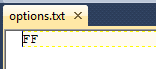
*Figure 4* options.txt with FF as the algorithm

**robot.py** - showing algorithm to read search method from *options.txt*

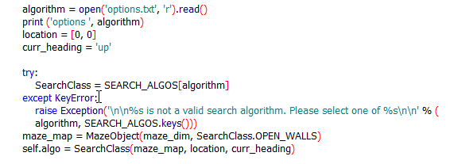

The included **instructions.txt** shows how to use the _options.txt_ file to test the various algorithms.

#### Maze management functions

In addition to the algorithm implementation, I also developed the maze management
routines in *maze_management.py.* 

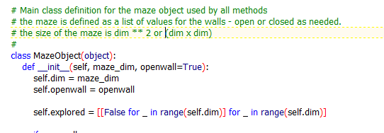

Maze management includes the definition of a map of the maze that is built by
the algorithms as they *explore* the maze based on the *sensor inputs* and
*knowledge* of where the robot is in the maze.

#### Follow wall method

I chose to implement this rather than the dead end or random methods. The choice
was primarily based on my limited experience with building small robot vehicles
for simple navigation experiments. The challenge for the physical robot was not as 
complex as the maze navigation problem and I was operating without a time limit. 
Some of the issues I saw were the robot going around in loops or getting caught in a corner.

The *follow_wall.py* implementation of this method never made it to the goal
because it was “exploring” too much. The documented results show this.

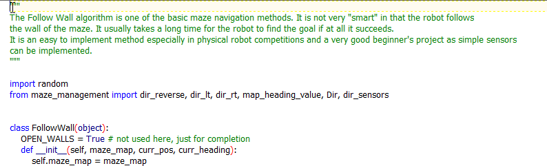

#### Graph Search methods

The graph search algorithms and the flood fill method were coded and tested next. 
These are in their own .py files (but they need *robot.py* to execute them).

The graph search methods are based on the UC Berkley implementations.
They are implemented in *graph_search.py.* Within this file the 4
graph search methods are implemented.

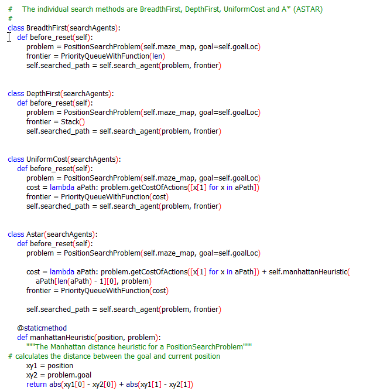
*Figure 5* Graph Search methods

##### *Discussion of Breadth First, Depth First and Uniform Cost methods*

This Wikipedia article gives a good overview of these algorithms [Graph
Traversal](https://en.wikipedia.org/wiki/Graph_traversal). It is good to
visualize the maze as a tree with the (0,0) or Home cell as the starting node.
The nodes or cells are connected to each other and are now available for
exploring.

Breadth First method first searches for open cells in its neighborhood (adjacent
cells) and then moves to the next level starting from the starting node. The
simple image below shows the steps a breadth first method would take.

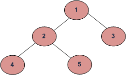
Figure 6 - Breadth First (geeksforgeeks.org)

Compared to Breadth First, Depth First searches for open cells in one branch
starting at the base node traversing till end and then starting with another
branch. The image below shows the depth first approach.

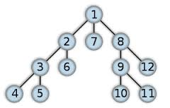
Figure 7 Depth First (wikipedia)

Uniform cost as the name implies, uses the cost (distance, time etc.) to reach
various nodes. This is different from the Breadth First and Depth First because
they use the depth of the branches to explore but don’t consider the cost. It is
also known as Dijkstra's Algorithm ([Wikipedia - Dijkstra's
Algorithm](https://en.wikipedia.org/wiki/Dijkstra%27s_algorithm)). The search
attempts to find the shortest path using costs and priority queuing.

##### *A\* (A Star) Search algorithm*

A\* search uses heuristics to search the graph and it is an informed search that
finds the path with the lowest cost. This Wikipedia article explains the concept
clearly ([Wikipedia - A Star
Search](https://en.wikipedia.org/wiki/A*_search_algorithm)). In the code in
*graph_search.py* I have used the logic made available by UC Berkley from its
Pacman coursework for their Intro to AI class (link given earlier). It can be
seen that the Manhattan Heuristic (also called Manhattan distance – referring to
the grid layout of Manhattan, NY) is in use here. Please see this article to
understand the admissibility of the heuristic ([Admissible
Heuristic](https://en.wikipedia.org/wiki/Admissible_heuristic)). The results
show that A\* Search performs well searching for the goal.

#### Flood Fill algorithm

Flood Fill algorithm has been extensively used in graph processing applications.
It is particularly useful in “color fill”, image manipulation and map
applications where a given area has to be colored (or filled with a color) or an
existing color needs to be replaced in images [(Wikipedia Flood
Fill)](https://en.wikipedia.org/wiki/Flood_fill). One of the best explanations
of flood fill is here (repeated for quick reference) [Recursion explained with
the Flood Fill
...](http://inventwithpython.com/blog/2011/08/11/recursion-explained-with-the-flood-fill-algorithm-and-zombies-and-cats/)
.

This algorithm has been used for maze navigation in the micromouse competition.
The key point is that this method starts with the assumption that the
maze has no walls. With this assumption it is easy to calculate the direct distance from
start to the center goal. As the algorithm progresses it maintains lists of
explored cells and builds cells as per walls detected. This is a recursive
process.

It is easier to understand if we go back to the water flow analogy – that the
maze’s goal is at the bottom and water flows to that (like an inverted pyramid).

This is implemented in *flood_fill.py* . The results show that this algorithm achieves 
consistent scores for all the mazes in all the trials.

Refinement
----------

Although the Internet is a great source of python code for maze solving, it was
quite an experience to (a) understand the various approaches and (b) to
implement solutions to this particular problem.

I had to clearly understand the interaction of the *robot* object with the
*tester.py* program to make sure that the sensor information was correctly
processed at each step. The fact that the maze text file could not be directly
read and the map created for solving made the task challenging – that of
navigating an unexplored maze. I studied the *maze.py* and the *showmaze.py*
code to visualize the map and that inspired me to create the
*maze_management.py* to manage the various activities associated with the maze.
As I developed the solution code, the maze management code also got modified as
needed.

I tested the code regularly and used the PyCharm tools to manage the trials and
to debug. The end results do show that the Flood Fill method is consistent in
solving and is robust enough to score the same for every trial meaning it was
able to find the correct and optimal path every time. Of the graph search
algorithms, A\* search comes close to being the best solution.

IV. Results
===========

Model Evaluation and Validation
-------------------------------

All results were collected in a spreadsheet and the following chart shows the
scores, normalized scores, minimums and averages.

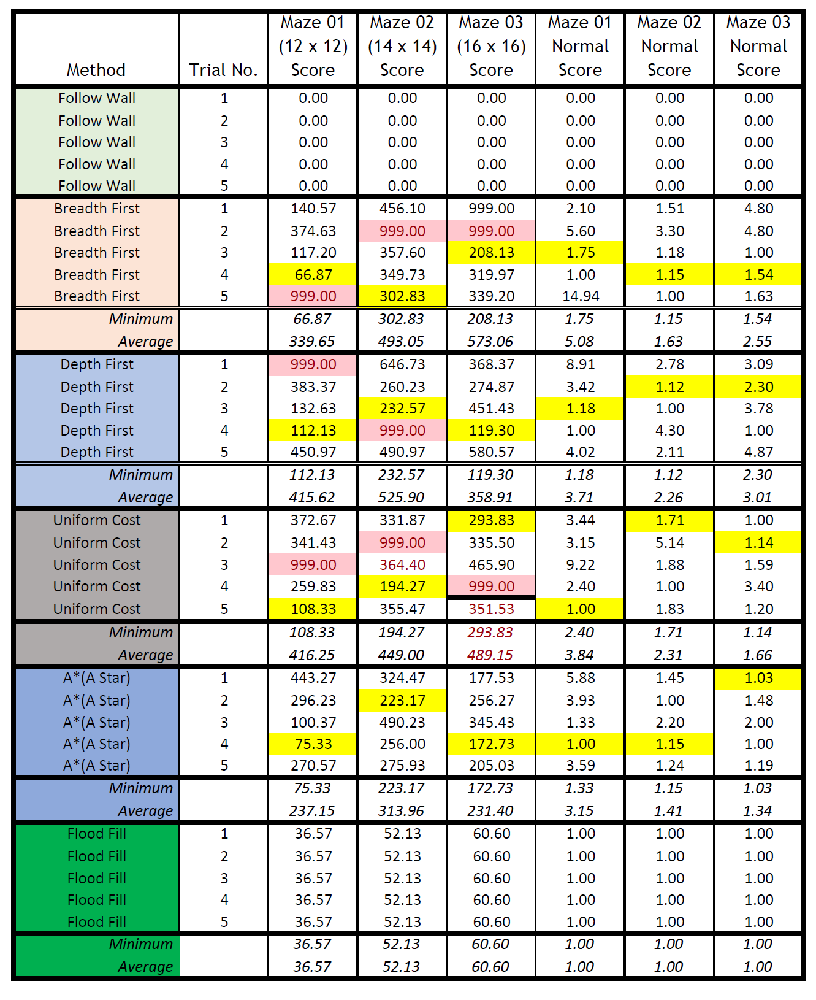

The table shows the following:

-   Method – the algorithm that was tested

-   Trial No. – number of each trial – 5 per method

-   Maze 01, 02, 03 Score(s) – these are scores as reported by the *tester.py*
    program

    -   Please note that the “999” values indicate trials that did not complete
        in the given time, except for Follow Wall where I have marked the failed
        runs with “0”.

    -   The “999” values are useful in calculating the “Minimum” and “Average”
        results as well as in the calculation of the “Normal Score”

-   Maze 01, 02, 03 Normal Score – the “Normal” score shows the normalized score
    for each method using this formula:

    -   **Normal Score = trial score/best score for the method**

    -   This Normal Score helps us compare any given score to the best score for
        that method. So a score of “1” would indicate that it is the Best Score
        for that trial (maze, run).

    -   For example:

        -   For Breadth First Maze 1, Trial 1:

            -   Normal score 140.57/66.87 that equals 2.10

        -   The best score for this trial is 66.87 (Trial run 4)

        -   This indicates that Trail 1 is 2.10 times worse than the best run.

    -   The best (= lowest) scores are highlighted in yellow.

The table also shows the minimum and average Scores and Normal Scores for each
method. Please note that the “1” score is not included in the calculation of
minimum Normal Score as it indicates the division by the same Score.

Looking at the scores we can observe:

-   Follow Wall method fails the trials as it could not complete any run for any
    of the mazes within the 1000 time steps allocated.

-   Any trial that has either a “999” or “0” indicates a solution that is not
    optimal or robust.

    -   Breadth First, Depth First and Uniform Cost all had trials that could
        not complete as shown by the “999” scores in one or more of their trial
        runs.

-   A\* search scores show near consistent results and the minimum Normal scores
    are closer to 1.

-   The Flood Fill scores show the for each maze, for each trial the score is
    consistent.

    -   As every trial results in the same score for each maze the Normal score
        is “1” and we don’t see any variance between trials.

The results clearly show that **_Flood Fill_** should be the algorithm of choice as it
is *most efficient* (with the lowest scores for each trial) and *consistent* (every
trial has the same score indicating that Flood Fill finds the best path and
executes it).

Justification
-------------

Comparing the A\* search and Flood Fill scores (figure below) for each maze
the scores for Flood Fill are significantly better than our benchmark method,
A\* search. 

The Flood Fill algorithm has been proven in many applications as a
robust and optimal method. The scores show that the Flood Fill method is
consistent across all trials, whereas in A\* search and others each trial has a
different score showing a level of randomness in decision making while
navigating.

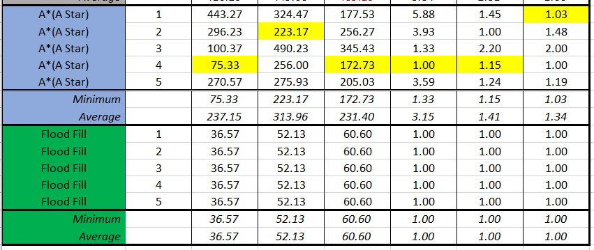

V. Conclusion
=============

Free-form Visualization
-----------------------

The following figure shows a couple of possible paths for the 12 x 12 maze.
There are more than these 2 paths to reach the goal as can be seen. This is to
demonstrate that there are multiple paths to the goal.

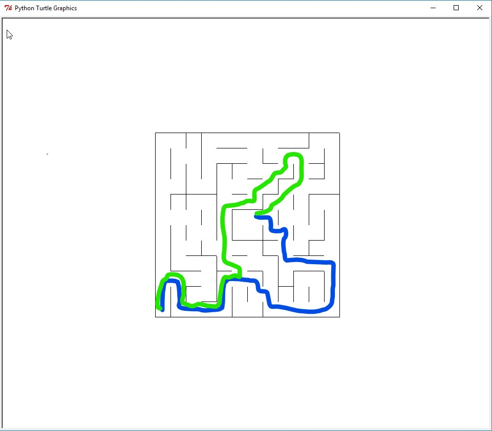

The following figure shows the terminal output of a A\* trial run. Please note
the number of steps and the final score shown (the picture shows the beginning,
the end of the first run, beginning of the final run (or run 1) and the final
results. A sample terminal output file is included in the documentation for this
project – *A-Star-sample-run.txt.* The output in the file shows the full run.

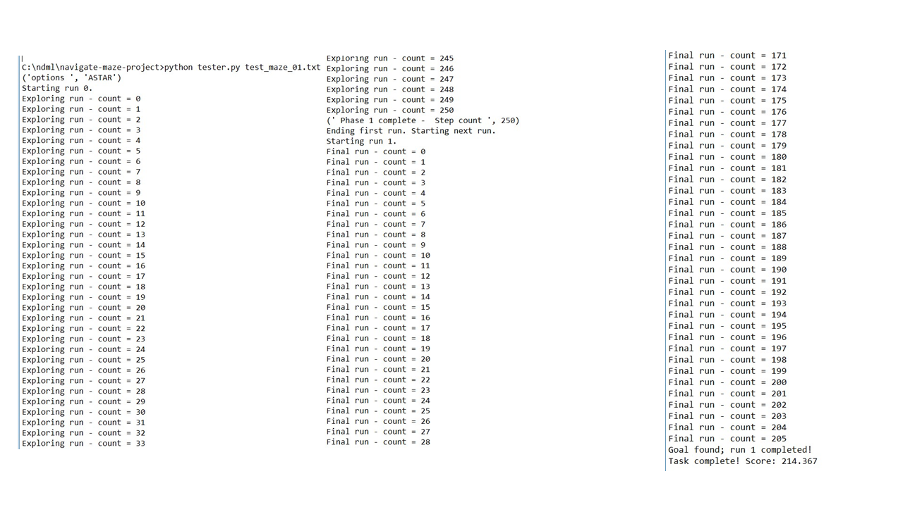

Similarly, the Flood Fill trial run is shown below. It shows the beginning of
the trial and the end. Please see the enclosed *Flood-fill-sample-run.txt* for a
full console output. The full console output shows that Flood Fill explores the
maze multiple times to find the optimal path and then executes it consistently
and gets the same score every time for a given maze.

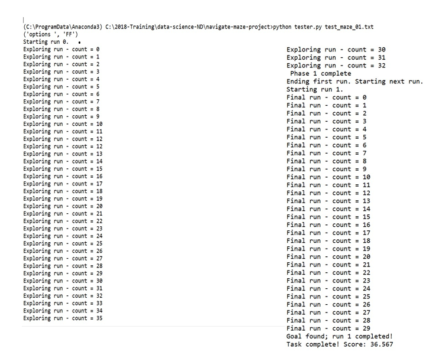

While running the trials, I noticed that methods other than Flood Fill took 
different number of steps (these can be seen on the console when the trials are run) 
to reach the goal navigating via different routes on each run. 
Compared to these, Flood Fill search consistently ran the same path every time.

Reflection
----------

I picked this project due to my interest in robotics competitions such as FIRST,
DARPA challenges and the Trinity College Fire Fighting robot contest. This project is
different from the physical robot in these competitions. It was very interesting and challenging
as this project helped me learn many of the maze navigation theories starting with treating a maze
as a graph to understanding flood fill.

It would be interesting to see if the run time limitation was removed whether
the other algorithms managed to navigate the maze. As *tester.py* is not to be
modified I did not try this.

During my research, I found that mazes come in all different sizes and have many
properties such as having many dead ends, loops and braids. Please see this link
([Maze Classification](http://www.astrolog.org/labyrnth/algrithm.htm)),
especially the section Routing. A partial screen shot shows this topic:

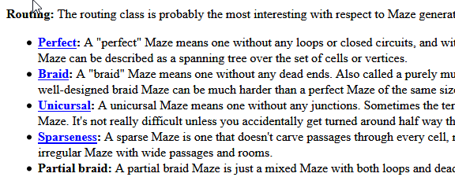

It was very good to learn how the micromouse competition has influenced so many
teams and the varied approach people have taken to contest. The application of
Flood Fill in graphics manipulation and A\* in games opens areas of exploration
for me.

Improvement
-----------

It would have been good to have a maze generator to test different maze configurations.
The main purpose was to see how these grid navigation methods simulate machine learning. 
Next, I would like to see if A\* search or Flood Fill can be used in one of my robot projects 
for collision detection and avoidance.

In physical implementation, one could use more sensors such as a camera, IR sensors, wheel encoders etc.
This project demonstrates how even with just 3 sensors we can have a very effective virtual robot.  I learnt a lot
doing this project in areas of robot movement that I had not thought of before. 

References
==============

1.  BreezySLAM: A Simple, efficient, cross-platform Python package for
    Simultaneous Localization and Mapping Suraj Bajracharya Professor Levy CSCI
    493 April 28, 2014 BreezySLAM

2.  Program Arcade Games with Python and PyGame
    (<http://programarcadegames.com/index.php?chapter=example_code&lang=en>)

3.  Introduction to A\*, Red Blob Games:
    [(http://www.redblobgames.com/pathfinding/a-star/introduction.html)](http://www.redblobgames.com/pathfinding/a-star/introduction.html)

4.  Analysis of Micromouse Maze Solving Algorithms: David M Willardson
    (<http://web.cecs.pdx.edu/~edam/Reports/2001/DWillardson.pdf>)

5.  UC Berkley Pacman project ([CS 188 Intro to
    AI](http://ai.berkeley.edu/project_overview.html))

6.  Exploring a Maze: Interactive Python
    (<http://interactivepython.org/courselib/static/pythonds/Recursion/ExploringaMaze.html>)

Appendix: Test Maze visualization using showmaze.py – 14x14 and 16x16
=====================================================================

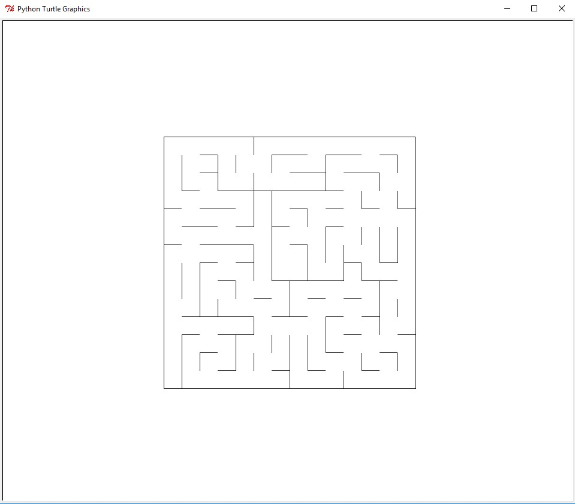

Figure 11 - Test Maze 02 (14 x 14)

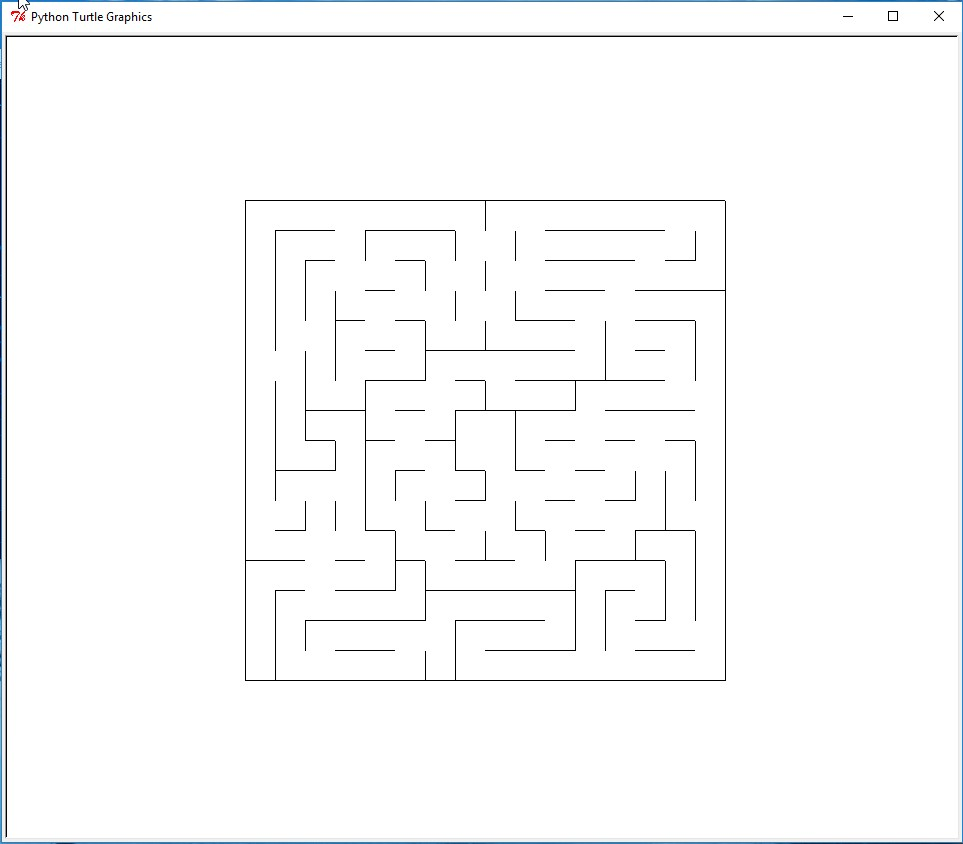

Figure 12 - Test Maze 03 (16 x 16)

